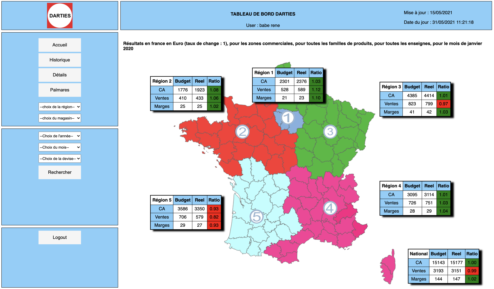
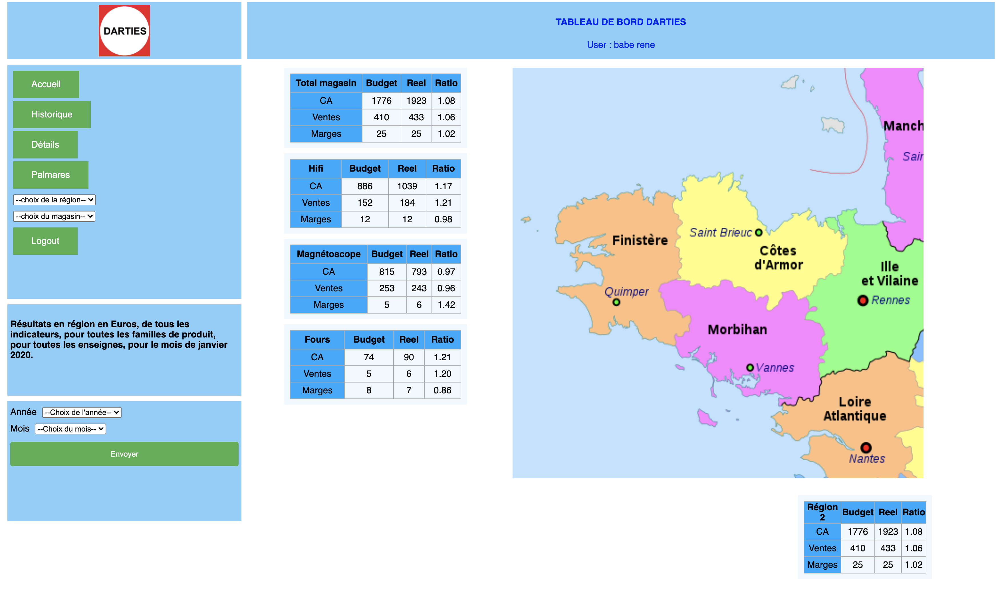
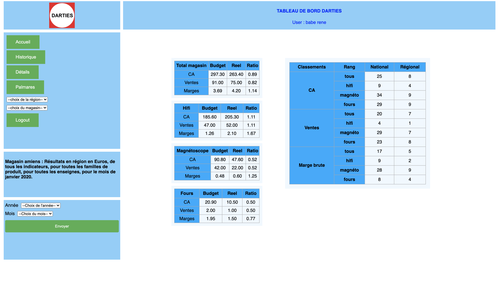

# Darties - web development project -  web app with flask for darties interface

By Alessio Rea

==============================

You need to have Python 3.8.5 installed for this project. You also need to have docker.

# Context of the project

The app is available at the following address : https://darties.herokuapp.com
Use the following user credentials to log in :
# babe|rene|rene_babe|babe|rene_babe@darties.com|1|||2021
# playa|stephanie|stephanie_playa|playa|splaya31@gmail.com|2|1||2021
# rea|alessio|alessio_rea|rea|alessio_rea@darties.com|2|2||2021
# garraouii|oussama|oussama_garraouii|garraouii|oussama.garraouii@gmail.com|3||1|2021
# touati|mahe|mahe_touati|touati|touaaatimahe@gmail.com|3||11|2021
# perrin|aenor|aenor_perrin|perrin|aenor_perrin@darties.com|3||47|2021

Note that all of those users have different access rights.

## 1. Purpose of the project

The purpose of the project is to build the interface for the darties project.

- Welcome page :
    

- Region :
    

- Store :
    

