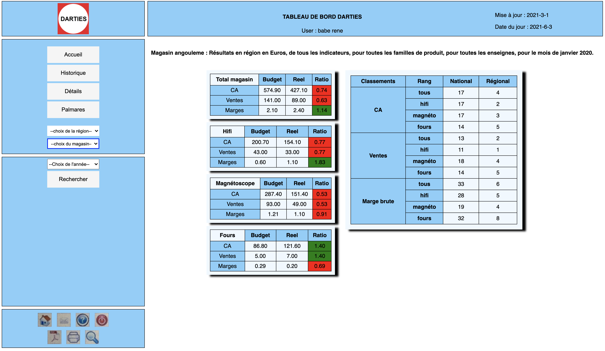

# Darties - web development project -  web app with flask for darties interface

By Alessio Rea

==============================

You need to have Python 3.8.5 installed for this project. You also need to have docker in order to run **Airflow**.

# Context of the project

## 1. Purpose of the project

The purpose of the project is to build the interface for the darties project.

- Welcome page :
    

- Region :
    

- Store :
    

