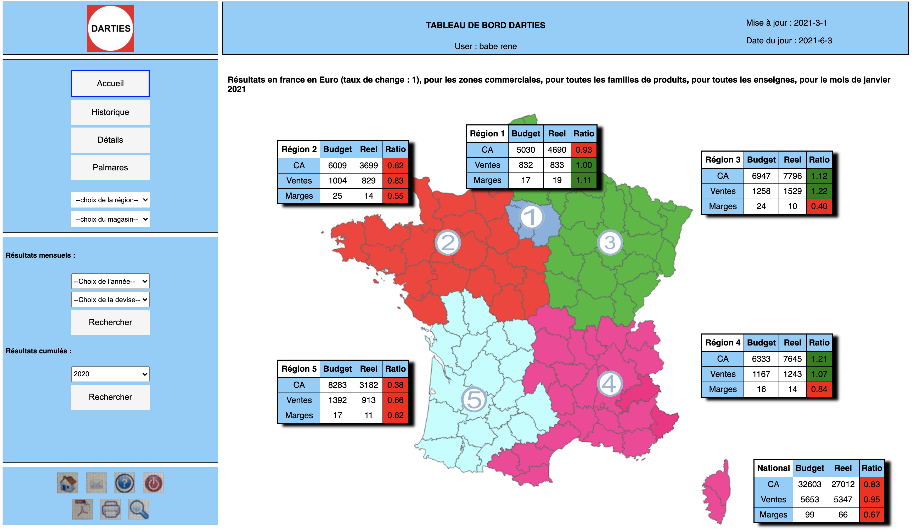

# Darties - web development project -  web app with flask for darties interface

By Alessio Rea

==============================

You need to have Python 3.8.5 installed for this project. You also need to have docker.

# Context of the project

The app is available at the following address : https://darties.herokuapp.com
Use the following user credentials ( pwd | login ) to log in :
- babe | rene_babe@darties.com
- playa | splaya31@gmail.com
- rea | alessio_rea@darties.com
- garraouii | oussama.garraouii@gmail.com
- touati | touaaatimahe@gmail.com
- perrin | aenor_perrin@darties.com

Note that all of those users have different access rights.

## 1. Purpose of the project

The purpose of the project is to build the interface for the darties project.

- Welcome page :
    

- Region :
    

- Store :
    

